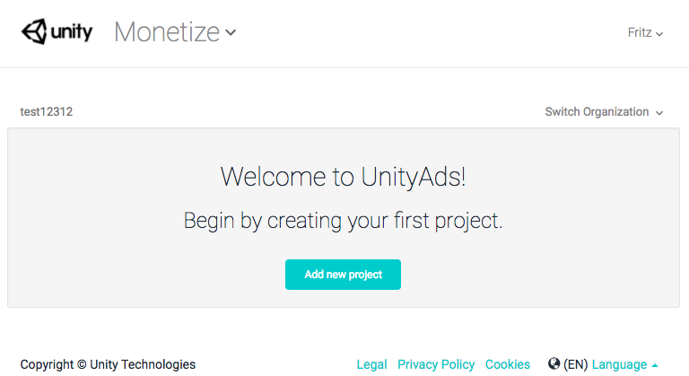
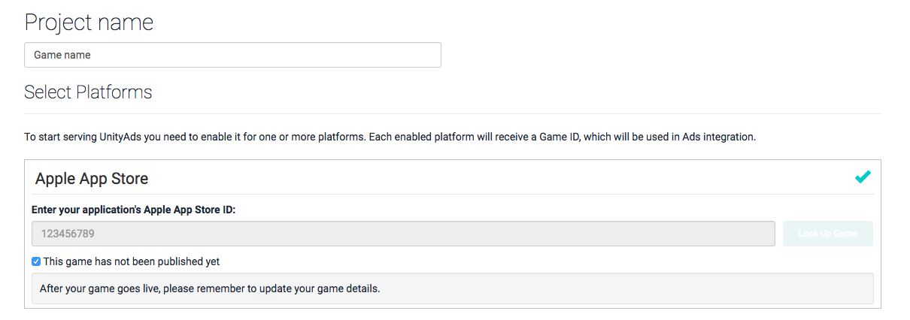
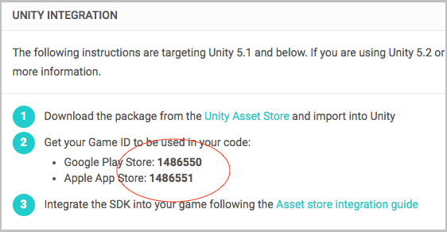
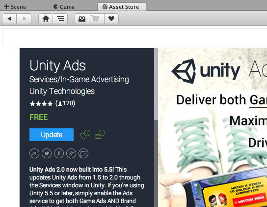

#### Welcome to Unity Ads!

Unity Ads can be enabled in **Unity 4.6 or later**.

Click here for Official Unity Ads documentation and additional integration paths:

- [Unity Ads Documentation](https://docs.unity3d.com/Manual/UnityAdsHowTo.html)
- [Unity Ads Knowledge Base](http://unityads.unity3d.com/help/monetization/getting-started)
- [Native iOS integration](http://unityads.unity3d.com/help/monetization/integration-guide-ios)
- [Native Android integration](http://unityads.unity3d.com/help/monetization/integration-guide-android)

# INTEGRATING UNITY ADS WITH THE ASSET PACKAGE

> Updated: July 20th, 2017

### Create a Game ID in the Unity Ads dashboard

BEfore integrating, you'll need to create a Unity Ads game ID.

Navigate to https://dashboard.unityads.unity3d.com and create a new game project.



Select iOS, Android, or both.



Locate the platform-specific GAME ID and save it for later.



Additional information on placements and dashboard settings can be found in our [placements Documentation](http://unityads.unity3d.com/help/monetization/placements).

### Integrate the Unity Ads Asset Package

Befet the build targets and enable Unity Ads in the Services Panel.

1. Open your game project, or create a new Unity project.
2. Select **Edit > Build Settings**, and set the platform to iOS or Android.
3. Enable Ads in the Unity Services window.


Next, import the Unity Ads Asset Package into your project.



### Add the code

1. First, declare the Unity Ads namespace in the header of your script:  
 	`using UnityEngine.Advertisements;`

2. Next, inititalize Unity ads:
	`Advertisement.Initialize(string gameId)`
	
> Note: It generally takes 5-10 seconds to inititalize Unity Ads

3. Once Unity Ads is ready, you can show an ad any time:
	if(
	`Advertisement.Show(string placement)`

### Reward Players for Watching Ads

Rewarding players can add to user engagement, resulting in higher revenue!

Typically rewarded ad implementation generally involve one or more of the following: 

- In-game currency or consumables
- Extra lives at the start of the game
- Point boosts for the next round

You can reward players for completing a video ad using the **HandleShowResult** callback method in the example above. Be sure to check that the video was not skipped before granting the reward.

```csharp
Advertisement.Show("rewardedVideo", options);

...

void HandleShowResult (ShowResult result)
{
	if (result != ShowResult.Skipped) {
		//reward your player here!
	}
}
```

### Rewarded Ad Button Example Code

[The Unity Ads Scipting API can be found here](https://docs.unity3d.com/ScriptReference/Advertisements.Advertisement.html)

```csharp
using UnityEngine;
using UnityEngine.Advertisements;

public class UnityAdsButton : MonoBehaviour
{
	//Inititalize on start
	void Start () 
	{
		if (Advertisement.isSupported) {
			Advertisement.Initialize (gameId, true);
		}
	}

	//show an ad with the "rewardedVideo" placement by calling this method
	void ShowAd ()
	{
		if(Advertisement.IsReady("rewardedVideo")) {
			var options = new ShowOptions();
			options.resultCallback = HandleShowResult;
			Advertisement.Show("rewardedVideo", options);
		}else{
			Debug.Log("Unity Ads not available");
		}
	}

	//HandleShowResult will be called when the ad stops playing, and pass the result enumerator
	void HandleShowResult (ShowResult result)
	{
		if(result == ShowResult.Finished) {
			Debug.Log("Video completed - Offer a reward to the player");
			
		}else if(result == ShowResult.Skipped) {
			Debug.LogWarning("Video was skipped - Do NOT reward the player");
			
		}else if(result == ShowResult.Failed) {
			Debug.LogError("Video failed to show");
		}
	}
}
```

Additional examples and troubleshooting can be found in our [monetization documentation](http://unityads.unity3d.com/help/monetization/integration-guide-unity).
If you have any questions, please post them to the [Unity Ads forum](http://forum.unity3d.com/forums/unity-ads.67) or contact us at unityads-support@unity3d.com


